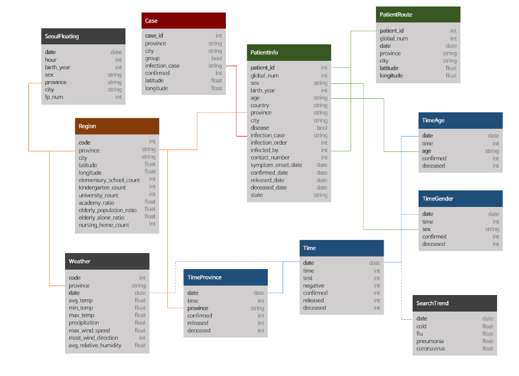
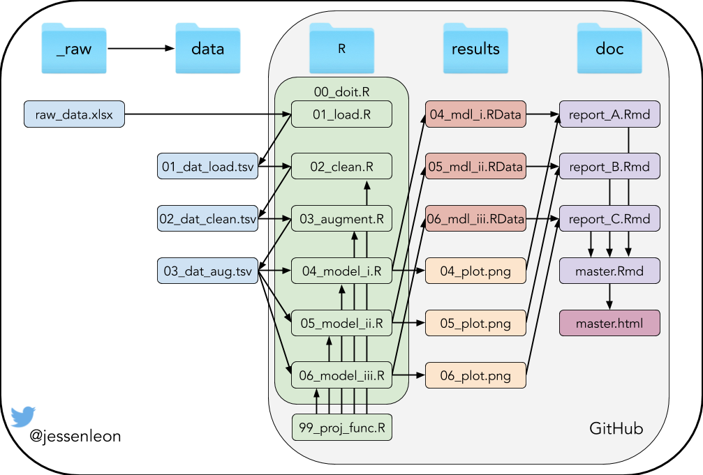

```{r setup, include=FALSE}
library(knitr)
opts_chunk$set(echo = FALSE)
```
## **Introduction**

### *South Korea during COVID-19*
South Korea is a one of the world's most densely populated countries with a population of 51.64 million people.

The first case of COVID-19 in South Korea was confirmed on the 20th of January 2020.

Since then there has only been 256 deaths caused by COVID-19.

(Insert one of our graphs showing no of cases?)

## Research questions
What measures taken by the South Korean government has been effective to contain the outbreak?

## Materials and methods
```{r out.width = "60%", fig.align='right',fig.cap= "COVID-19 dataset from kaggle" }

```


***

### Structure of the project
```{r, fig.width = 1}

include_graphics('images/workflow.png')
```


***
### Packages used
- [Tidyverse](https://github.com/tidyverse/tidyverse)
- [igraph](https://github.com/igraph/igraph)
- [viridis](https://github.com/sjmgarnier/viridis)    
- [maptools](https://github.com/RPTools/maptool)
- [gpclib](https://github.com/rdpeng/gpclib)
- [rgdal](https://github.com/cran/rgdal/tree/master/inst)
- [plotly](https://github.com/plotly)  

***

### Data cleaning
- Get rid of unnecessary data


***
### Data augmenting
- Join tibbles
- Create new variables

Four main data frames were created regarding:

- patient
- case
- city
- time

## Results
### Patient data
Tracking the place where people got infected and the places they have been.

```{r out.width = "50%", fig.show = "hold"}
include_graphics(c('../results/05_model_case_type.png', '../results/10_most_visited_places.png'))

```


```{r out.width = "100%", fig.align = "center"}

```
## Slide

```{r }

```

