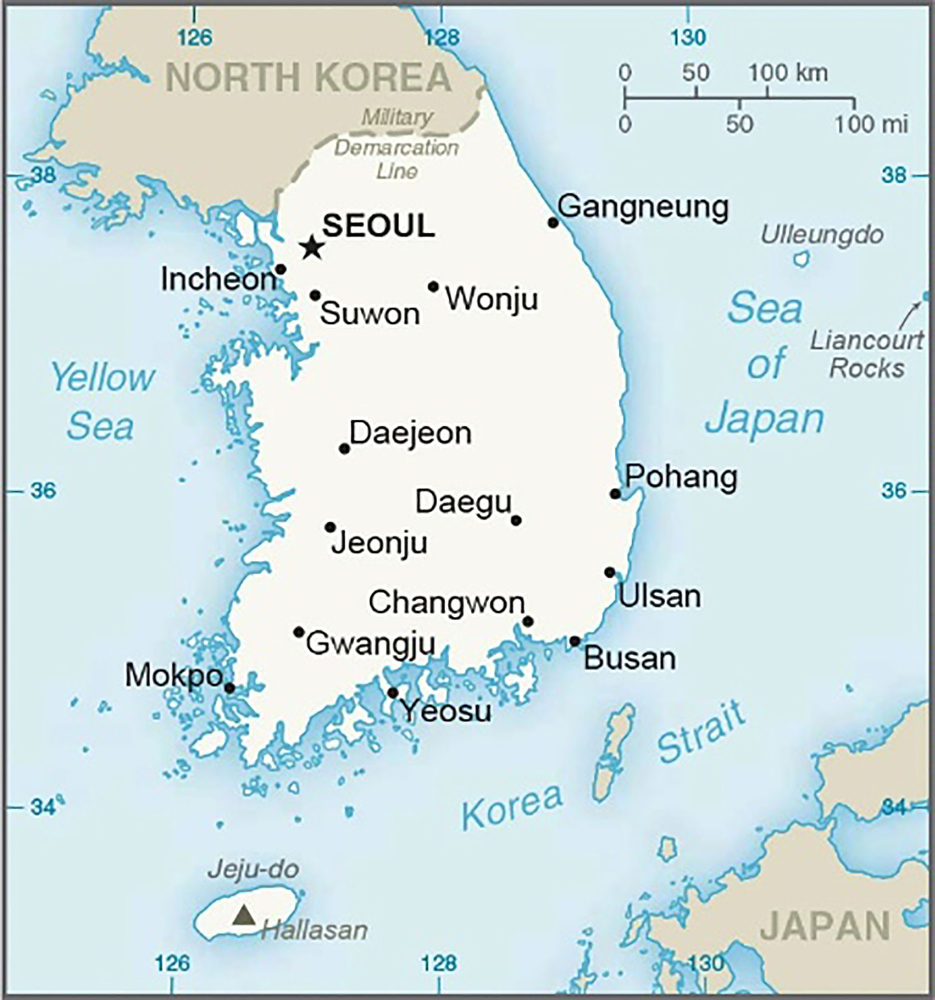
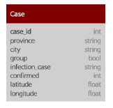
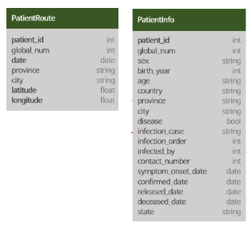
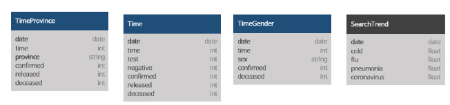
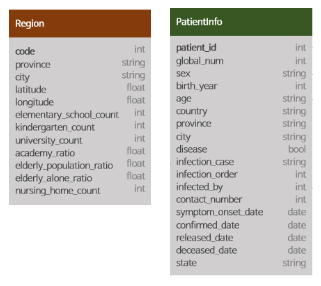
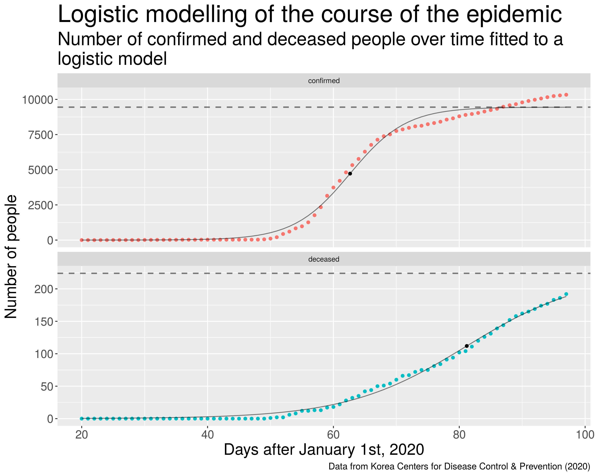
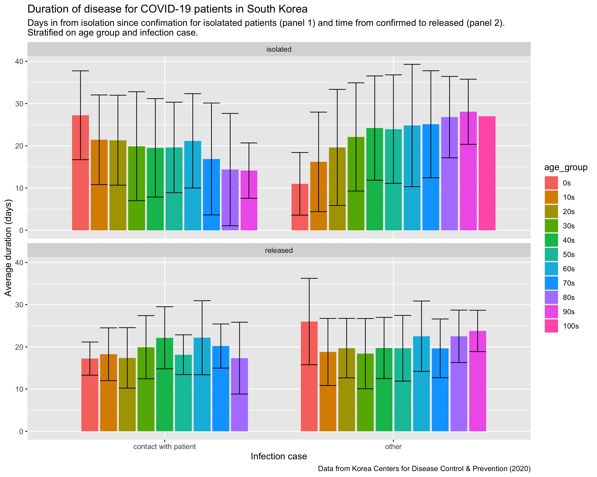
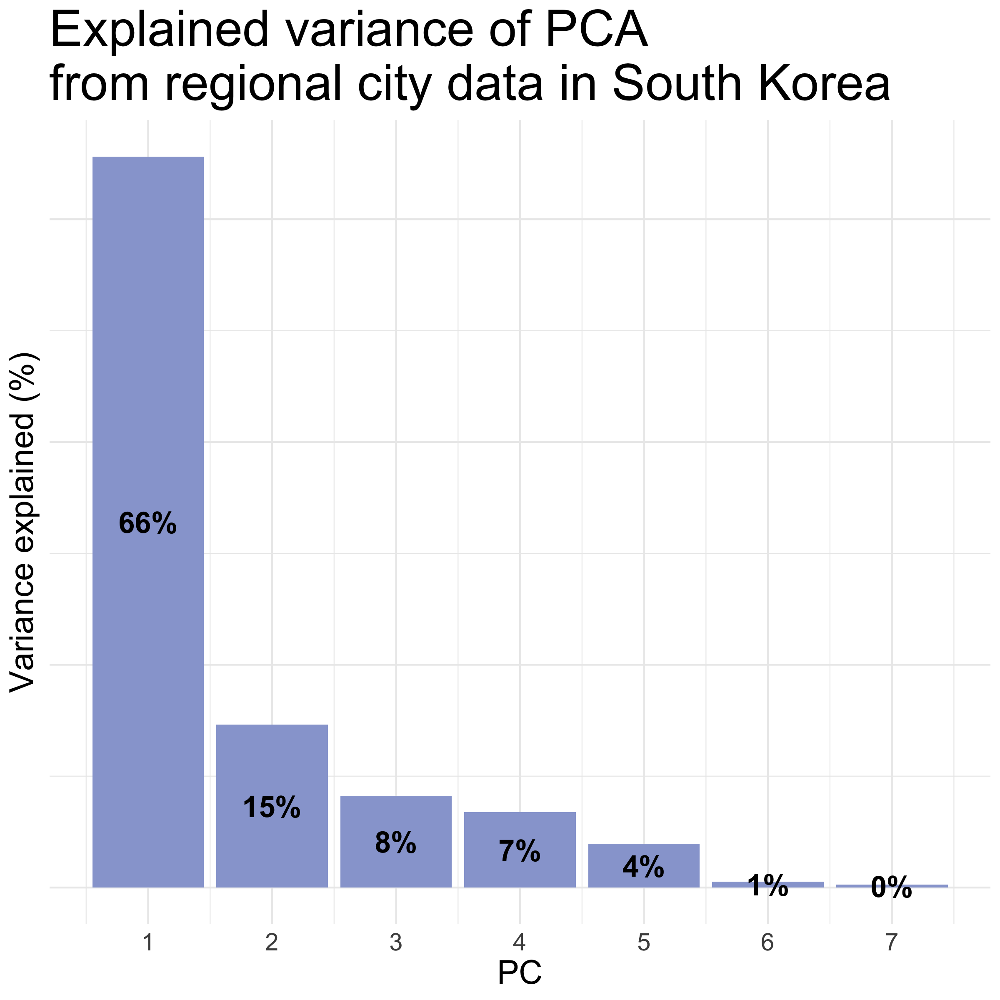
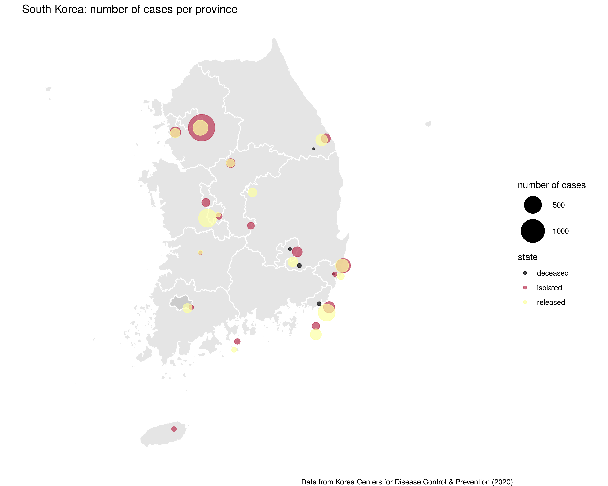

```{r setup, include=FALSE}
library(knitr)
library(tidyverse)
knitr::opts_chunk$set(echo = FALSE)
```
## **Introduction**

### *South Korea during COVID-19*
* One of the world's most densely populated countries 

* 51.64 million inhabitants

* First case of COVID-19 confirmed on the 20th of January 2020

* 259 deaths caused by COVID-19


```{r out.width = "20%", fig.align='center',fig.cap= "(South Korean Map, United States. Department Of State)" }

```

## Research questions

* How has the epidemic evolved in South Korea?

* How is human behaviour driving the spread of the disease?

* Is there any correlation between the place of infection and severity of the disease?

* Does any gender or age predispose for getting the disease or for a more severe outcome?

* Can characteristic city features be used to predict the burden of disease?


## Materials and methods

<h3 style="margin-top: -50px">
The dataset
</h3>

[Korean COVID-19 dataset](https://www.kaggle.com/kimjihoo/coronavirusdataset)
Last downloaded 07-04-2020

```{r out.width = "60%", fig.align='center',fig.cap= "COVID-19 dataset from Kaggle" }
include_graphics('dataset.png')
```

***

### Workflow and Structure of the project
#### Reproducibility
- The project includes all steps in the data analysis
- To achieve consistent computational results

```{r, fig.width = 1, fig.align='center'}
include_graphics('project_structure.png')
#include_graphics('images/workflow.png')
```

***
### Packages for the project

**Project core**:

-   [tidyverse](https://github.com/tidyverse/tidyverse)

**Extension of ggplot**:

-   [ggrepel](https://github.com/slowkow/ggrepel), [patchwork](https://github.com/thomasp85/patchwork)

**Rendering transmission networks**:

-   [ggraph](https://github.com/thomasp85/ggraph)

**Rendering maps**:

-   [maptools](https://github.com/RPTools/maptool), 
    [gpclib](https://github.com/rdpeng/gpclib), [rgdal](https://github.com/cran/rgdal/tree/master/inst)

**Shiny app (+ maps and geo-location packages)**

-   [geosphere](https://github.com/rspatial/geosphere), [shiny](https://github.com/rstudio/shiny),
    [leaflet](http://rstudio.github.io/leaflet)

***

### Data cleaning

-   Remove non valid data (NA's)
    
-   Remove non necessary columns.
    
-   Converting data into the tidy format:
    
    -   Each variable has a column
        
    -   Each observation has its own row
        
    -   Each value has its own cell
        

### Data augmenting

-   Joining dataset tables using full_join
    
-   Subsetting data
    
-   Combining columns using unite
    
-   Creating new variables for the analysis

***

#### Final datasets

- Case data ( Case )
```{r, fig.width = 1, fig.align='center'}

```

- Patient data (Patient info + Patient route)
```{r, fig.width = 1, fig.align='center'}

```

- Time data (Time + Time age + Time gender + Time province + SearchTrend)
```{r, fig.width = 1, fig.align='center'}

```

- City data (region + Patient info)
```{r, fig.width = 1, fig.align='center'}

```

## Results

<h3 style="margin-top: -50px">
How has the epidemic evolved in South Korea?
</h3>
```{r out.width = "65%", fig.align = "center"}
include_graphics('../results/13_disease_progress.png')
```

***

<h3 style="margin-top: -50px">
How has the epidemic evolved in South Korea?
</h3>

```{r out.width = "75%", fig.align = "center"}

```

***

<h3 style="margin-top: -50px">
How has the epidemic evolved in South Korea?
</h3>
```{r out.width = "100%", fig.align = "center"}
include_graphics('../results/15_searchtrend.png')
```

***

<h3 style="margin-top: -50px">
How is human behaviour driving the spread of the disease?
</h3>

```{r out.width=c('50%', '50%'), fig.show='hold'}
include_graphics(c('../results/10_most_visited_places.png', '../results/05_case_type.png'))
```

***

<h3 style="margin-top: -50px">
How is human behaviour driving the spread of the disease?
</h3>
```{r out.width = "90%", fig.align = "center"}
include_graphics('../results/16_transmission.png')
```
***

<h3 style="margin-top: -50px">
Is there any correlation between the place of infection and severity of the disease?
</h3>
```{r out.width = "70%", fig.align = "center"}

```

***

<h3 style="margin-top: -50px">
Does any gender or age predispose for getting the disease or for a more severe outcome?
</h3>
```{r out.width=c('50%', '50%'), fig.show='hold'}
include_graphics(c('../results/13_disease_age.png', '../results/12_age_deceased_ratio.png'))
```

***

<h3 style="margin-top: -50px">
Does any gender or age predispose for getting the disease or for a more severe outcome?
</h3>
```{r out.width=c('50%', '50%'), fig.show='hold'}
include_graphics(c('../results/13_confirmed_gender.png', '../results/13_deceased_gender.png'))
```

***

<h3 style="margin-top: -50px">
Can characteristic city features be used to predict the burden of disease?
</h3>
```{r out.width = c("50%","50%"), fig.hold = "hold", message=FALSE}
include_graphics(c('../results/08_city_pca.png', '../results/11_city_clustering.png'))

cluster_pred <- read_tsv("../data/wrangled_cluster_pred.tsv") %>% 
  mutate(score_org = str_c(round(score_org*100, 1), "%"),
         score_pca = str_c(round(score_pca*100, 1), "%"))

knitr::kable(cluster_pred, format="html")
```

***

<h3 style="margin-top: -50px">
Can characteristic city features be used to predict the burden of disease?
</h3>

**ANN Network**
```{r message=FALSE}
include_graphics('neural_network_viz.png')

ann_pred <- read_tsv("../data/wrangled_ann_pred") %>%
  mutate(accuracy = str_c(round(accuracy*100, 1), "%")) %>%
  select(accuracy)

knitr::kable(ann_pred, format="html")
```

## Shiny app

https://erik-kiehl.shinyapps.io/shiny_app/

## Conclusion and discussion 

* There’s no correlation between the place of infection and severity of the disease.

* More females are diagnosed with COVID-19, but more males die from the disease.

* Young people are driving the spread.

* People in their 70s and 80s have a higher fatality rage.

* There are clusters of superspreaders of certain age range. 

* ANN and k-means accuracy is between 40-50 % - better than random with 4 classes.

***
### Superspreaders
```{r out.width = "70%", fig.align = "center"}
include_graphics('../results/17_subset_transmission.png')
```

***
### Correlation matrix
```{r out.width = "70%", fig.align = "center"}
include_graphics('../results/06_cor_heatmap.png')
```
***
### PCA Variance explained
```{r out.width = "55%", fig.align = "center"}

```

### Regional cases plot
***
```{r out.width = "75%", fig.align = "center"}

```

