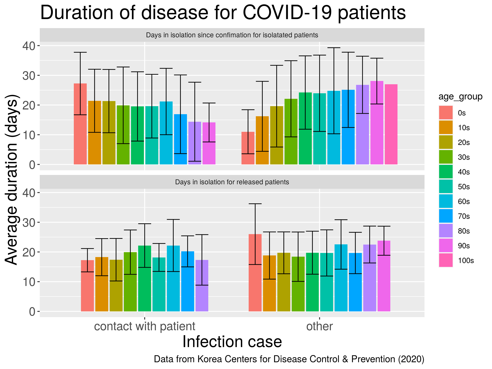

```{r setup, include=FALSE}
library(knitr)
knitr::opts_chunk$set(echo = FALSE)
```
## **Introduction**

### *South Korea during COVID-19*
South Korea is one of the world's most densely populated countries with 51.64 million people.

The first case of COVID-19 in this country was confirmed on the 20th of January 2020. Since then, there has only been 256 deaths caused by COVID-19.


## Research questions
* Have the measures taken by the South Korean government been effective to contain the outbreak?

* Is there any correlation between the place of infection and severity of the disease?

* Does gender or age predispose for getting the disease or for severe outcome?

* Is it possible to predict the outcome of the infection?

* Are there any characteristic features in the high-prevalence disease areas?


## Materials and methods
```{r out.width = "60%", fig.align='center',fig.cap= "COVID-19 dataset from kaggle" }
include_graphics('dataset.png')
```

## Workflow and Structure of the project
```{r, fig.width = 1}
include_graphics('project_structure.png')
include_graphics('images/workflow.png')
```


***
### Packages used
Project core:

- [Tidyverse](https://github.com/tidyverse/tidyverse)

Transmission:

- [igraph](https://github.com/igraph/igraph)

Map: 

- [viridis](https://github.com/sjmgarnier/viridis)    
- [maptools](https://github.com/RPTools/maptool)
- [gpclib](https://github.com/rdpeng/gpclib)
- [rgdal](https://github.com/cran/rgdal/tree/master/inst)
- [plotly](https://github.com/plotly)  

# Shiny app
geosphere
shiny


***

### Data cleaning
- Get rid of unnecessary data
- Remove non valid data
- Converting data into a tidy format

* filter(), mutate ()


***
### Data augmenting

- Join tibbles
- Create new variables
- Transform
- Subset the data

* full_join(), mutate(), unite ()

***
Four main data frames were created regarding:

<div class="green">
- patient (patient_info_df + patient_route_df)
</div>
<div class="red">
- case
</div>
<div class="yellow">
- city
</div>
<div class="blue">
- time (time_df, time_age_df, time_province_df)
</div>
<div class="grey">
- serchtrend
</div>

SeoulFloating and Weather were not used

Problem: our data set repeats the same name for come columns.

Solution: added a prefix


## Results

```{r out.width = "50%", fig.show = "hold"}
include_graphics(c('../results/10_most_visited_places.png', '../results/05_model_case_type.png'))

```

***
### PCA
```{r out.width = "55%", fig.align = "center"}
include_graphics('../results/08_model_pca.png')
```

***
### PCA - variance
```{r out.width = "55%", fig.align = "center"}
include_graphics('../results/08_model_pca_variance.png')
```

***
### Correlation matrix
```{r out.width = "70%", fig.align = "center"}
include_graphics('../results/06_model_cor.png')
```

***
### City clustering
```{r out.width = "85%", fig.align = "center"}
include_graphics('../results/11_city_clustering.png')
```

***
### Case number (map) {.smaller}
```{r out.width = "68%", fig.align = "center"}
include_graphics('../results/07_cases_number.png')
```

***
### Disease progess
```{r out.width = "65%", fig.align = "center"}
include_graphics('../results/13_disease_progress.png')
```

***
### Disease progess logistic modelling
```{r out.width = "65%", fig.align = "center"}
include_graphics('../results/13_logistic_model.png')
```

***
### Deceased and confirmed by gender
```{r out.width = "50%"}
include_graphics(c('../results/13_confirmed_gender.png', '../results/13_deceased_gender.png'))
```

***
### Deceased by age
```{r out.width = "65%", fig.align = "center"}
include_graphics('../results/13_disease_age.png')
```

***
### Case fatility rate {.smaller}
using nest()
```{r out.width = "50%", fig.align = "center"}
include_graphics('../results/12_age_deceased_ratio.png')
```

***
### Case fatility rate
```{r out.width = "70%", fig.align = "center"}

```

***
### Transmission
```{r out.width = "70%", fig.align = "center"}
include_graphics('../results/16_transmission.png')
```

***
### Superspreaders
```{r out.width = "70%", fig.align = "center"}
include_graphics('../results/17_subset_transmission.png')
```

***
### Search trend 
```{r out.width = "80%", fig.align = "center"}
include_graphics('../results/15_searchtrend.png')
```


## Conclusion and discussion 


## Problems and solutions

Using different packages will mask some functions.
 
 - detach packages after each R cript.
 

