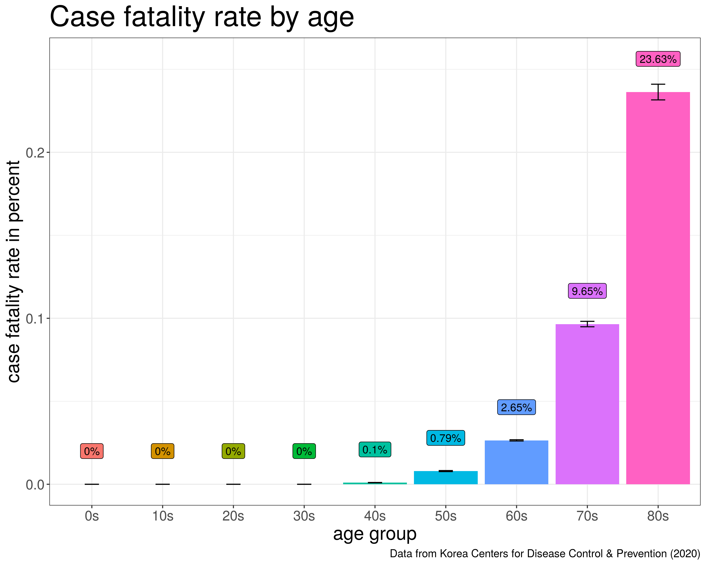
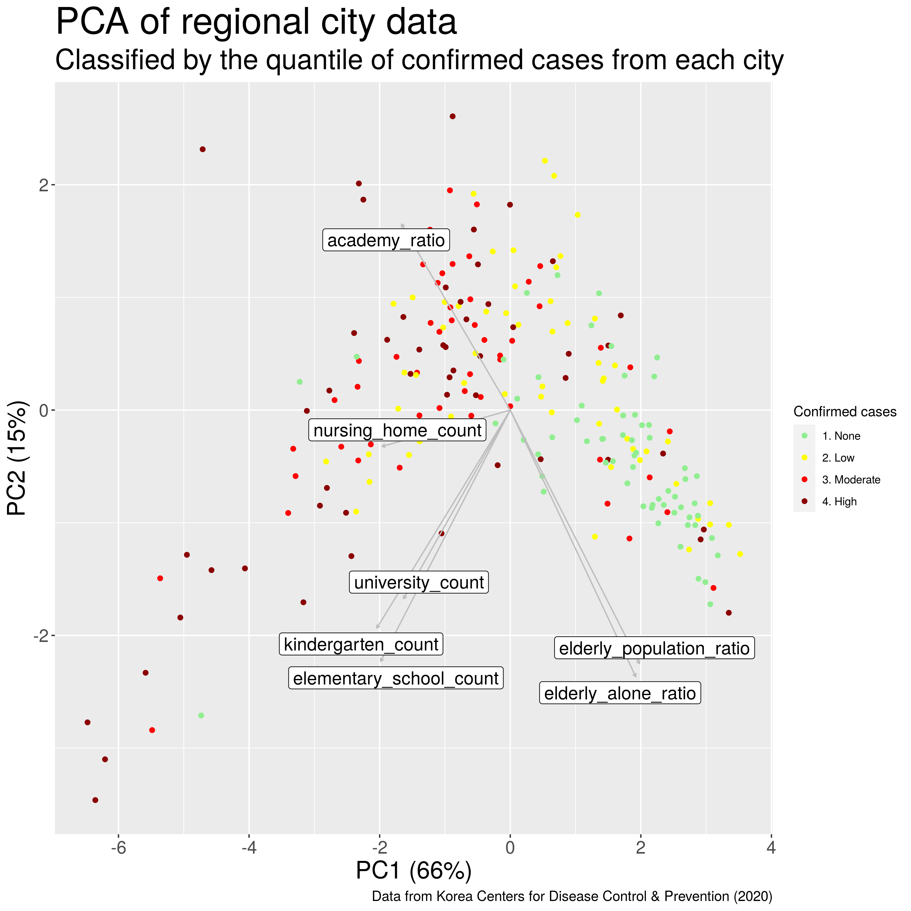
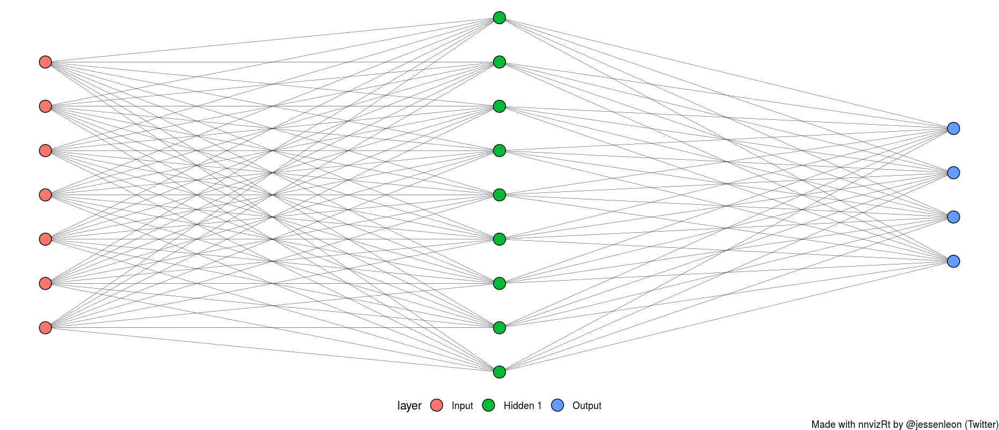
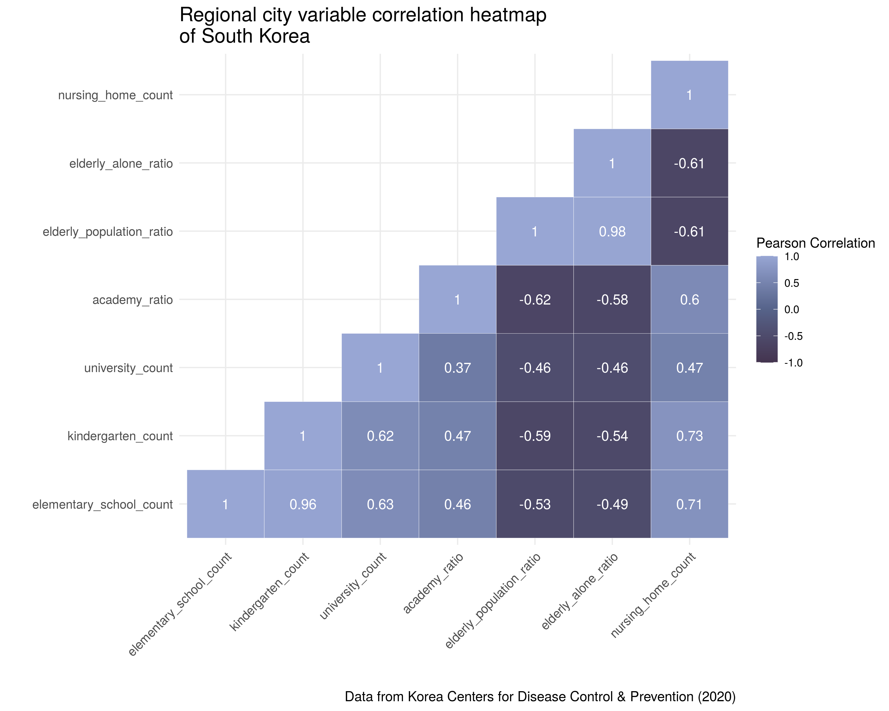
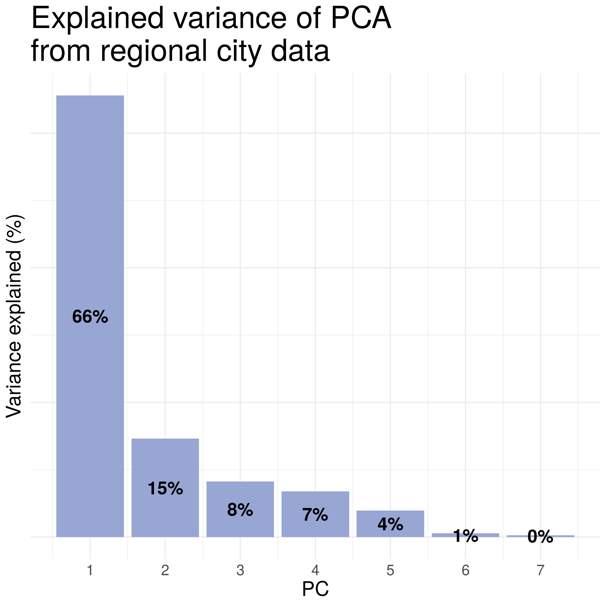
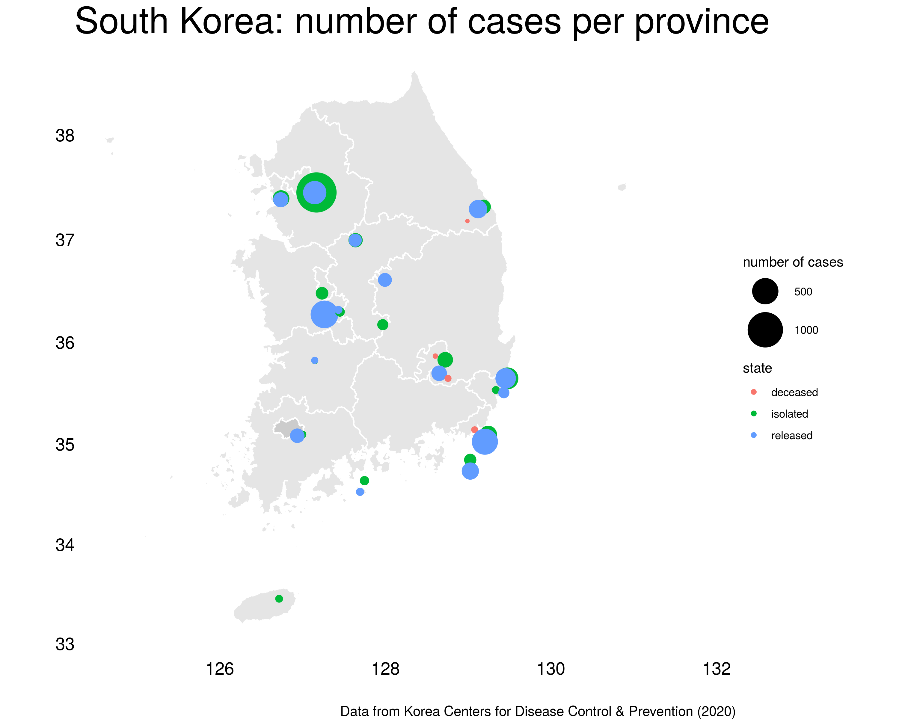

```{r setup, include=FALSE}
library(knitr)
library(tidyverse)
knitr::opts_chunk$set(echo = FALSE)
```
## **Introduction**

### *South Korea during COVID-19*
South Korea is one of the world's most densely populated countries with 51.64 million people.

The first case of COVID-19 in this country was confirmed on the 20th of January 2020. Since then, there has only been 256 deaths caused by COVID-19.


## Research questions

* How is human behaviour driving the disease?

* How has the epidemic evolved in South Korea?

* Is there any correlation between the place of infection and severity of the disease?

* Does any gender or age predispose for getting the disease or for a more severe outcome?

* Are there any characteristic features in the high-prevalence disease areas?

* Can a prediction of the disease confirmation be made based on city features?


## Materials and methods

<h3 style="margin-top: -50px">
The dataset
</h3>

[Korean COVID-19 dataset](https://www.kaggle.com/kimjihoo/coronavirusdataset)
Last downloaded 07-04-2020

```{r out.width = "60%", fig.align='center',fig.cap= "COVID-19 dataset from Kaggle" }
include_graphics('dataset.png')
```

***

### Workflow and Structure of the project
#### Reproducibility
- The project includes all steps in the data analysis
- To achieve consistent computational results

```{r, fig.width = 1, fig.align='center'}

#include_graphics('images/workflow.png')
```

***
### Packages for the project

**Project core**:

-   [tidyverse](https://github.com/tidyverse/tidyverse)

**Extension of ggplot**:

-   [ggrepel](https://github.com/slowkow/ggrepel), [patchwork](https://github.com/thomasp85/patchwork)

**Rendering transmission networks**:

-   [ggraph](https://github.com/thomasp85/ggraph)

**Rendering maps**:

-   [maptools](https://github.com/RPTools/maptool), 
    [gpclib](https://github.com/rdpeng/gpclib), [rgdal](https://github.com/cran/rgdal/tree/master/inst)

**Shiny app (+ maps and geo-location packages)**

-   [geosphere](https://github.com/rspatial/geosphere), [shiny](https://github.com/rstudio/shiny),
    [leaflet](http://rstudio.github.io/leaflet)

***

### Data cleaning

-   Remove non valid data (NA's)
    
-   Remove non necessary columns.
    
-   Converting data into a tidy format following the <u>tidy rules</u>
    
    -   Each variable has a column
        
    -   Each observation has its own row
        
    -   Each value has its own cell
        

### Data augmenting

-   Joining dataset tables using full_join
    
-   Subsetting data
    
-   Combining columns using unite
    
-   Creating new variables for the analysis

***

#### Final datasets

- Case data ( Case )
```{r, fig.width = 1, fig.align='center'}

```

- Patient data (Patient info + Patient route)
```{r, fig.width = 1, fig.align='center'}

```

- Time data (Time + Time age + Time gender + Time province + SearchTrend)
```{r, fig.width = 1, fig.align='center'}

```

- City data (region + Patient info)
```{r, fig.width = 1, fig.align='center'}

```

## Results
<h3 style="margin-top: -50px">
How is human behaviour driving the disease
</h3>

```{r out.width=c('50%', '50%'), fig.show='hold'}
include_graphics(c('../results/10_most_visited_places.png', '../results/05_case_type.png'))
```

***

<h3 style="margin-top: -50px">
How has the epidemic evolved in South Korea?
</h3>
```{r out.width = "65%", fig.align = "center"}
include_graphics('../results/13_disease_progress.png')
```

***

<h3 style="margin-top: -50px">
How has the epidemic evolved in South Korea?
</h3>

```{r out.width = "75%", fig.align = "center"}
include_graphics('../results/13_logistic_model.png')
```

***

<h3 style="margin-top: -50px">
Research question
</h3>
```{r out.width = "100%", fig.align = "center"}
include_graphics('../results/15_searchtrend.png')
```

***

<h3 style="margin-top: -50px">
Research question
</h3>
```{r out.width = "70%", fig.align = "center"}
include_graphics('../results/13_disease_age.png')
```

***

<h3 style="margin-top: -50px">
Research question
</h3>
```{r out.width=c('50%', '50%'), fig.show='hold'}
include_graphics(c('../results/13_confirmed_gender.png', '../results/13_deceased_gender.png'))
```

***

<h3 style="margin-top: -50px">
Research question
</h3>
```{r out.width = "55%", fig.align = "center"}

```

***

<h3 style="margin-top: -50px">
Research question
</h3>
```{r out.width = "80%", fig.align = "center"}
include_graphics('../results/14_contact_exposure.png')
```

***

<h3 style="margin-top: -50px">
Research question
</h3>
```{r out.width = "90%", fig.align = "center"}
include_graphics('../results/16_transmission.png')
```

***

<h3 style="margin-top: -50px">
Research question
</h3>
```{r out.width = "55%", fig.align = "center"}

```

***

<h3 style="margin-top: -50px">
Research question
</h3>
```{r out.width = "90%", fig.align = "center", message=FALSE}
include_graphics('../results/11_city_clustering.png')

cluster_pred <- read_tsv("../data/wrangled_cluster_pred.tsv") %>% 
  mutate(score_org = str_c(round(score_org*100, 1), "%"),
         score_pca = str_c(round(score_pca*100, 1), "%"))

knitr::kable(cluster_pred, format="html")
```

***

<h3 style="margin-top: -50px">
Research question
</h3>

**ANN Network**
```{r message=FALSE}


ann_pred <- read_tsv("../data/wrangled_ann_pred") %>%
  mutate(accuracy = str_c(round(accuracy*100, 1), "%")) %>%
  select(accuracy)

knitr::kable(ann_pred, format="html")
```

## Shiny app

https://erik-kiehl.shinyapps.io/shiny_app/

## Conclusion and discussion 
* Confirmed cases is high compared to deaths. 

* One peak (until beginning of April), follows logistic model

* There’s no correlation between the place of infection and severity of the disease

* Men die but more women are confirmed to be sick. Young people are driving the spread.

* At least from the retrieved data, there is no strong difference.

* People in their 70s and 80s have a higher fatality rage (as expected).

***
* There are clusters of superspreaders and certain age range can be observed in each. 

* A higher disease prevalence can be observed in bigger cities and those who have nursing homes, which is very different from what can be seen in the countryside, where elderly population ratio and elderly alone present less cases. 

* Accuracy is just above 50 % - better than random with 4 classes.

* Similar performance as kmeans. 

Problems and solutions

Using different packages will mask some functions.
 
 - detach packages after each R cript.
 

***
### Superspreaders
```{r out.width = "70%", fig.align = "center"}

```

***
### Correlation matrix
```{r out.width = "70%", fig.align = "center"}

```
***
### PCA Variance explained
```{r out.width = "55%", fig.align = "center"}

```

### Regional cases plot
***
```{r out.width = "75%", fig.align = "center"}

```

